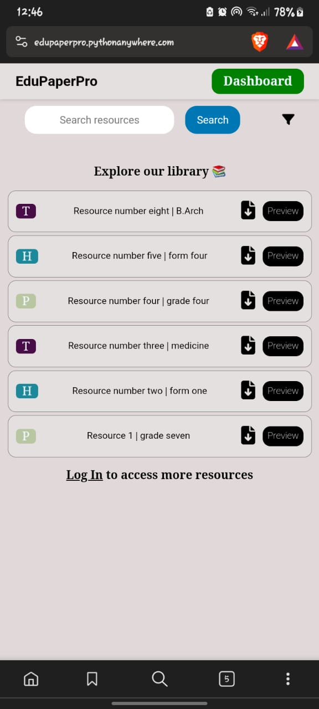
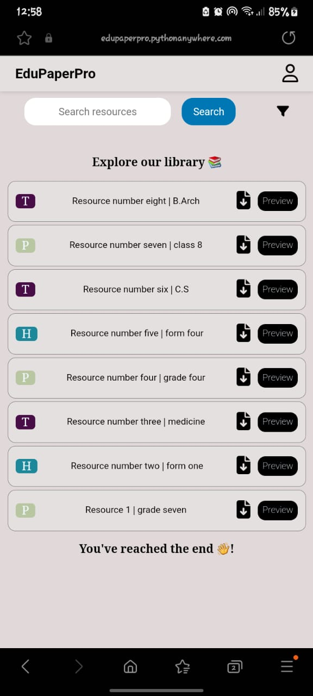
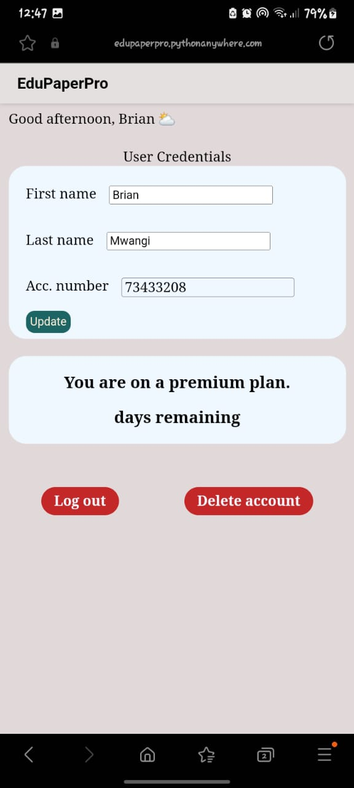
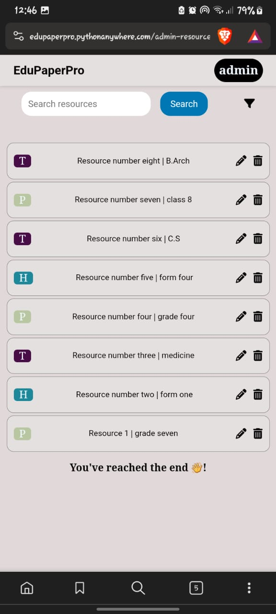

## Application Overview 

__EduPaperPro__ is an online platform designed to facilitate file sharing for students across different educational levels, ranging from lower primary school to high school and tertiary education.

At __EduPaperPro__, users gain access to a wide array of valuable resources, including past examination papers and revision materials provided in various formats such as PDF, DOCX, and more.

The platform offers both free and premium plans, with the latter coming soon.

The __free plan__ grants users access to complimentary resources, allowing them to preview and download educational materials at no cost.

The __premium plan__, on the other hand, offers unlimited access to resources on our platform. It also provides a resource filtering feature, allowing users to refine their searches based on their specific educational level and preferences.

To upgrade to a __premium plan__, users can choose from two convenient pricing options: __Kes. 200 per month__ or __Kes. 2000 per year__. The upgrade process involves initiating an __STK push__ to their __M-pesa__ mobile number, inputting their PIN to confirm the transaction, and subsequently activating their subscription. In the user's profile settings, they can view their unique account number, which serves as the identifier for their account and payments, as well as their current plan and the remaining days on their premium plan.

__EduPaperPro__ is committed to bridging the gap between students and digital learning, making educational resources more accessible and convenient for all.

_Below are screenshots of the app interface:_

__(a):__ This is the landing page. Here, only free resources are shown.

__(b):__ This is the dashboard. The user logged in currently is a premium user, which is why they can see more/all resources.

__(c):__ This is the profile page where the user can change their personal details,as well as view their plan.

__(d):__ This is the admin's dashboard, where they can update resource details, or delete them.
 
_This app is still in the development stage._ 
It can be found [here](edupaperpro.pythonanywhere.com)
